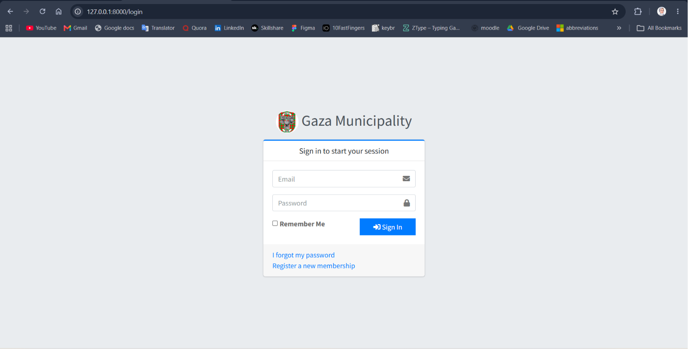
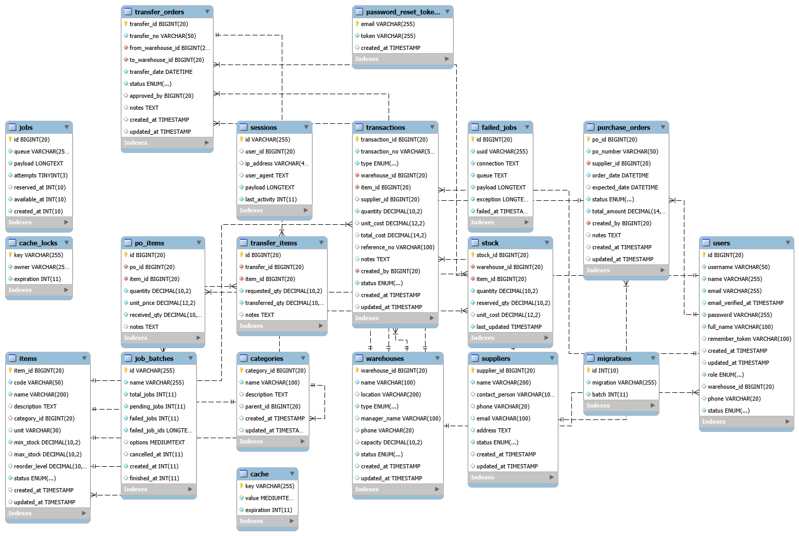
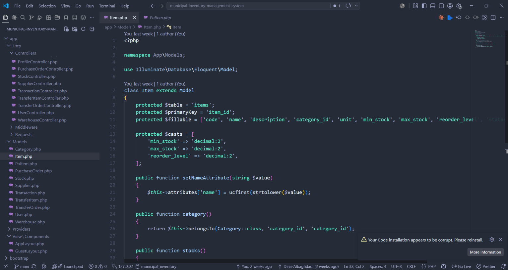
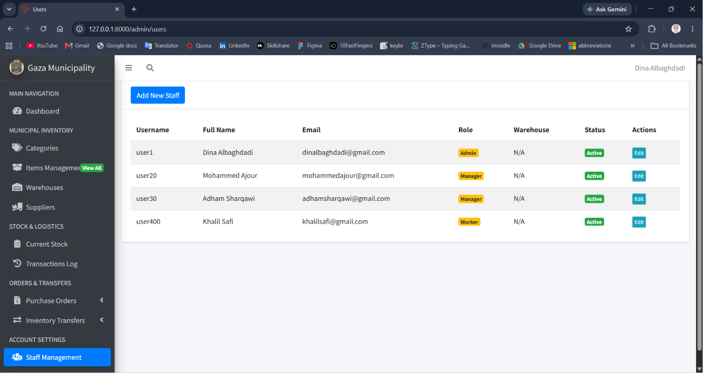
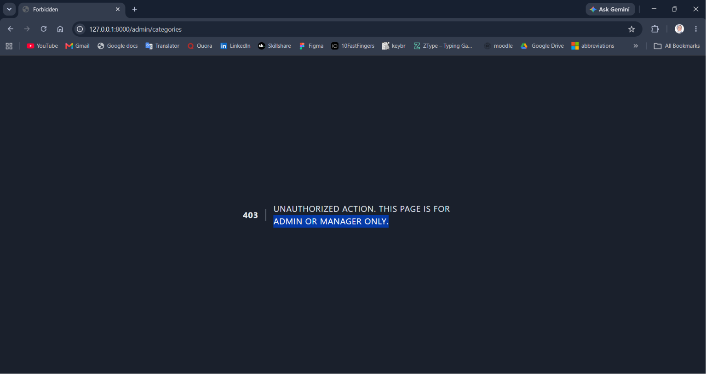
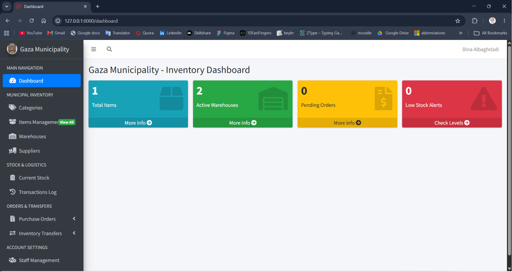
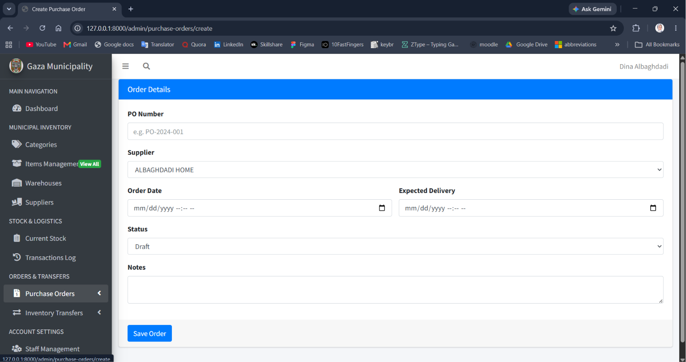
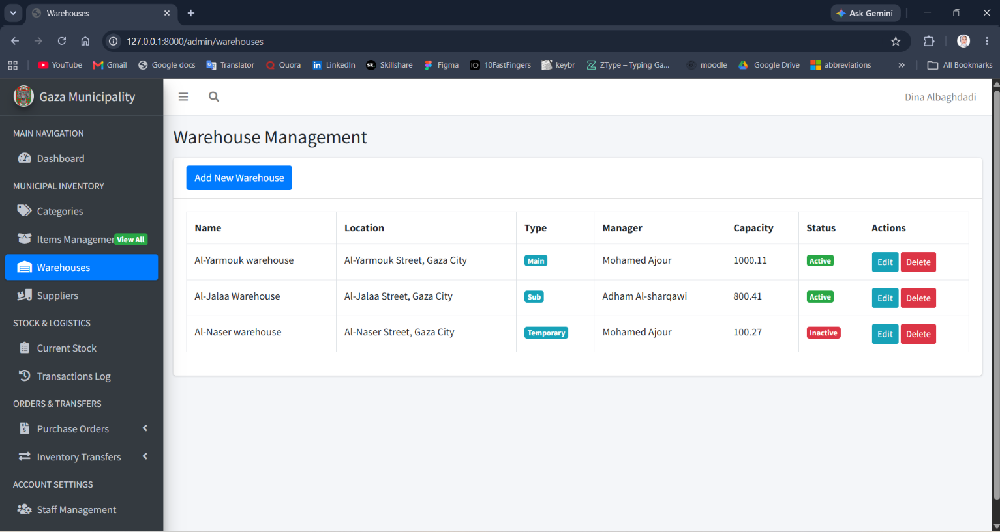
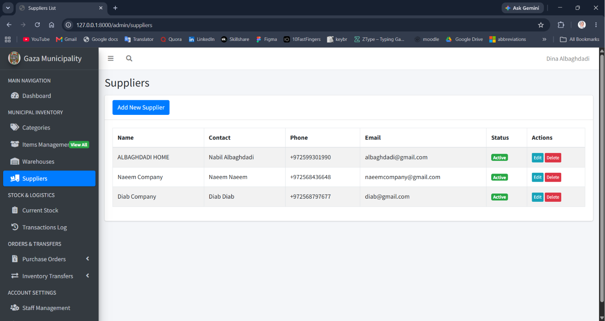

# Municipal Inventory Management System (MIMS) - Gaza Municipality

MIMS is a professional-grade inventory management platform developed using **Laravel 11** as part of the Field Training program at **Gaza Municipality (IT Department)** It is designed to mirror corporate standards by shifting from basic data entry to a fully governed administrative system that manages the entire lifecycle of municipal goods—from procurement to warehouse transfers.

---

## 1. Database Architecture & Schema
The system is built on a robust database consisting of **11 interconnected tables**, covering Categories, Items, Warehouses, Suppliers, Users, Stock, Transactions, Purchase Orders, and Transfers.

*   **Data Integrity:** Heavily reliant on Foreign Keys to ensure consistent and interconnected records.
*   **Precision:** Utilizes the `Decimal (10,2)` data type for all quantities and costs to maintain financial accuracy and prevent accounting discrepancies.

---

## 2. Advanced Backend Logic (Laravel 11)
The project leverages the full power of **Laravel 11** to handle complex municipal logistics:
*   **Eloquent ORM:** Implements advanced One-to-Many and Inverse Relationships across all 11 tables for seamless data navigation.
*   **Data Transformation:** Uses **Attribute Casting**, **Mutators**, and **Accessors** to ensure high inventory precision and standardized data entry.
*   **Mass Assignment Protection:** Every model is secured via the `$fillable` property to prevent malicious data injection.

---

## 3. System Governance & Security (RBAC)
Security is a top priority, ensuring that only authorized personnel can access sensitive inventory data.
*   **Role-Based Access Control (RBAC):** Defined roles for **Admin, Manager, and Worker** managed through custom Middleware and Laravel Gates.
*   **Authentication:** Integrated **Laravel Breeze** with a customized **Email-based login** to align with the municipality's administrative requirements.
*   **CSRF Protection:** All administrative routes and forms are secured against cross-site request forgery.

---

## 4. Operational Excellence & UI/UX
The user interface is built using the **AdminLTE 3** template, providing a professional and localized experience for staff.
*   **Live Dashboard:** A dynamic command center featuring an **automated Low Stock Alert system** that applies engineering logic to monitor inventory levels.
*   **Scalability:** Implements **Server-side Pagination** to handle high volumes of municipal data efficiently.
*   **Master Layouts:** Utilizes unified Blade templating for consistent Header, Sidebar, and Footer navigation.

---

## 5. Master-Detail Order Management
Specialized handling for **Purchase Orders** and **Warehouse Transfers** using a Master-Detail structure:
*   **Header-Detail Separation:** General info is stored in header tables, while specific goods are listed in detail tables (e.g., `po_items`).
*   **Transfer Oversight:** Tracks requested vs. transferred quantities across multiple warehouses with real-time stock updates.

---

## Technical Stack
*   **Framework:** Laravel 11.x
*   **Database:** MySQL / MariaDB (managed via XAMPP)
*   **Frontend:** Blade Engine, Vite, AdminLTE 3
*   **Tools:** Eloquent ORM, Laravel Breeze, PHP Artisan

---
**Developed by:** Dina Nabil Albaghdadi  
**Organization:** Gaza Municipality (IT Department)
